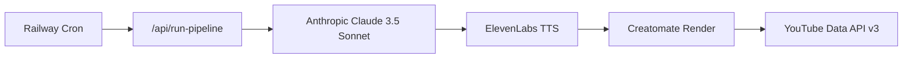

# YouTube Video Pipeline

Automated, programmatic YouTube video generation and upload pipeline built with TypeScript and designed for [Railway](https://railway.app) deployment.

## Architecture



| Module | Responsibility |
|--------|----------------|
| `src/config/` | Strongly-typed Railway environment variable loading |
| `src/services/llm.ts` | Script + JSON schema generation via Anthropic |
| `src/services/voice.ts` | ElevenLabs TTS, master MP3 to `/tmp` |
| `src/services/video.ts` | Creatomate template render + polling |
| `src/services/youtube.ts` | OAuth2 upload (private/unlisted by default) |
| `src/index.ts` | Express server + auth-protected cron endpoint |

## Quick Start

```bash
cd youtube-pipeline
cp .env.example .env
# Fill in API keys and tokens
npm install
npm run build
npm start
```

Trigger the pipeline:

```bash
curl -X POST http://localhost:3000/api/run-pipeline \
  -H "x-auth-token: $AUTH_TOKEN" \
  -H "Content-Type: application/json" \
  -d '{"topic":"The Hidden Physics of Black Holes"}'
```

Omit `topic` to use the default: **Deep-Dive Cosmic Mysteries**.

## Railway Deployment

1. Create a new Railway project and connect this repository.
2. Set the **root directory** to `youtube-pipeline` (or deploy this folder as its own repo).
3. Add all variables from `.env.example` in the Railway dashboard.
4. Deploy — Railway builds via the included `Dockerfile`.
5. Add a **Cron Job** that calls:

   ```
   POST https://<your-service>.up.railway.app/api/run-pipeline
   Header: x-auth-token: <AUTH_TOKEN>
   ```

## Creatomate Template

Your Creatomate template should expose element names matching the modification keys in `src/services/video.ts`:

| Modification key | Purpose |
|------------------|---------|
| `Master-Audio.source` | Master voiceover track |
| `Title-Text.text` | Video title overlay |
| `Thumbnail-Text.text` | Thumbnail headline |
| `Thumbnail-Image.prompt` | Thumbnail image prompt |
| `Scene-N-Image.prompt` | Scene background (N = 1..8) |
| `Scene-N-Overlay.text` | On-screen caption |
| `Scene-N-Voiceover.text` | Per-scene narration text |

Rename elements in your template to match, or adjust `buildModifications()` in `video.ts`.

## YouTube OAuth Setup

This pipeline uses a **pre-refreshed OAuth2 refresh token** (not a service account — YouTube uploads require user/channel OAuth):

1. Create a Google Cloud project and enable **YouTube Data API v3**.
2. Create OAuth 2.0 credentials (Web application).
3. Run the OAuth consent flow once to obtain a `refresh_token` for your channel.
4. Store `YOUTUBE_CLIENT_ID`, `YOUTUBE_CLIENT_SECRET`, and `YOUTUBE_REFRESH_TOKEN` in Railway.

Videos are uploaded as **`private`** by default (`YOUTUBE_PRIVACY_STATUS=private`). Change to `unlisted` only after you validate compliance workflows.

## Ephemeral Asset Hosting

Creatomate requires publicly reachable URLs for audio sources. During a pipeline run, the voiceover MP3 is registered as a **transient asset** and served from `/internal/assets/:token` until rendering completes. Set `PUBLIC_BASE_URL` to your Railway service URL (or rely on `RAILWAY_PUBLIC_DOMAIN` auto-detection).

## Compliance Safety

- Upload privacy is forced to `private` or `unlisted` via `status.privacyStatus` in the YouTube API payload.
- All temporary assets are written to an ephemeral run directory under `/tmp` and deleted after each run.
- The pipeline is stateless — no database required.

## Environment Variables

See [`.env.example`](.env.example) for the full list.

## Development

```bash
npm run dev      # hot reload with tsx
npm run typecheck
```

## License

MIT
