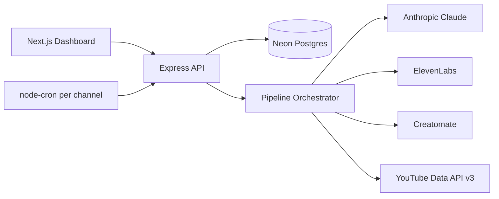

# YouTube Video Pipeline

Multi-tenant automated YouTube video generation and upload pipeline built with TypeScript, Postgres (Neon), and designed for [Railway](https://railway.app) deployment. Powers a separate Next.js dashboard for managing multiple channels from one backend.

## Architecture



Each **channel** has its own niche prompt, voice, Creatomate template, YouTube OAuth credentials, upload schedule, and monthly budget.

## Quick Start

```bash
cd youtube-pipeline
cp .env.example .env
# Set NEON_DATABASE_URL, ENCRYPTION_KEY, AUTH_TOKEN, and shared API keys
npm install
npm run build
npm run migrate-channel   # one-time: import legacy .env channel into DB
npm start
```

Trigger a channel pipeline manually:

```bash
curl -X POST http://localhost:3000/api/run-pipeline \
  -H "x-auth-token: $AUTH_TOKEN" \
  -H "Content-Type: application/json" \
  -d '{"channel_id":"<uuid>","topic":"Optional specific topic"}'
```

## Database Schema

| Table | Purpose |
|-------|---------|
| `channels` | Per-channel config, encrypted OAuth secrets, cron schedule, budget |
| `videos` | Pipeline runs, costs, YouTube IDs, publish status |
| `topics_used` | Per-channel topic deduplication |
| `channel_stats` | Subs, watch hours, monetization eligibility |

Schema is bootstrapped automatically on server startup from `src/db/schema.sql`.

## API Endpoints

All routes below require `x-auth-token: <AUTH_TOKEN>` (or `Authorization: Bearer`).

| Method | Path | Description |
|--------|------|-------------|
| `POST` | `/api/channels` | Create a channel |
| `GET` | `/api/channels` | List channels with latest stats |
| `GET` | `/api/channels/:id` | Channel detail |
| `PATCH` | `/api/channels/:id` | Update settings (niche, schedule, budget, status) |
| `DELETE` | `/api/channels/:id` | Remove a channel |
| `POST` | `/api/run-pipeline` | Run pipeline for `{ "channel_id": "..." }` |
| `GET` | `/api/pending` | Private videos awaiting dashboard review |
| `POST` | `/api/publish/:video_id` | Publish a reviewed video to public |
| `GET` | `/api/costs` | Monthly cost summary by channel |
| `GET` | `/api/monetization` | Refresh subs/watch-hours/eligibility per channel |

## Cron Scheduling

On startup the server loads all **active** channels and registers a `node-cron` job per channel using each channel's `upload_frequency` expression. Jobs are fully re-registered every 5 minutes so API changes to schedule or status are picked up without redeploying.

## Security

- `youtube_client_secret` and `youtube_refresh_token` are encrypted at rest with AES-256-GCM (`ENCRYPTION_KEY`)
- Secrets are decrypted in-memory only when running the pipeline or publishing
- Channel API responses never return encrypted secrets
- New uploads default to **private** until approved via `POST /api/publish/:video_id`

## Migration from Single-Channel

If you previously used env-based single-channel config:

```bash
# Keep legacy vars in .env (YOUTUBE_*, ELEVENLABS_VOICE_ID, CREATOMATE_TEMPLATE_ID, DEFAULT_TOPIC)
npm run migrate-channel
```

This inserts the first row into `channels` and sets status to `active`. After migration, per-channel settings live in the database; shared platform keys remain in Railway env vars.

## One-time OAuth setup

```bash
npm run get-token
```

See the OAuth section in previous docs — use the printed refresh token when creating a channel via `POST /api/channels`.

## Environment Variables

See [`.env.example`](.env.example). Required for production:

- `NEON_DATABASE_URL` (or `DATABASE_URL`)
- `ENCRYPTION_KEY`
- `AUTH_TOKEN`
- `ANTHROPIC_API_KEY`, `ELEVENLABS_API_KEY`, `CREATOMATE_API_KEY`

## Development

```bash
npm run dev
npm run typecheck
```

## License

MIT
